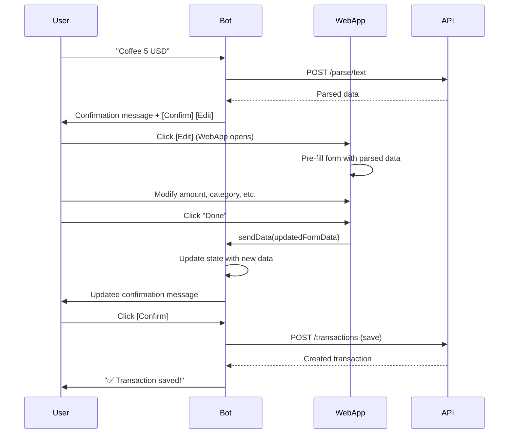

# Bot Integration Guide - WebApp Edit Flow

## How It Works Now

The WebApp **does NOT save** transactions. Instead, it:
1. Receives parsed data from bot
2. Lets user edit the data
3. Sends updated data **back to bot**
4. Bot updates the confirmation message
5. User clicks "Confirm" in bot to actually save

## Updated Bot Code

### 1. Update `editTransactionCallback` in `transaction.handler.ts`

Replace the function (around line 266) with:

```typescript
export async function editTransactionCallback(ctx: any) {
  await ctx.answerCbQuery();

  const user = await apiClient.getMe(ctx);
  const lang = (user.language_code || 'ru') as Language;
  const data = await stateManager.getData(ctx.from.id);

  if (!data.parsedTransaction) {
    await updateOrReply(ctx, t('transaction.outdated', lang));
    await stateManager.clearState(ctx.from.id);
    return;
  }

  // Encode the parsed data
  const encodedData = encodeURIComponent(JSON.stringify(data.parsedTransaction));
  
  // WebApp URL with parsed data
  const webAppUrl = `https://webapp.kapusta.whereismy.city/transaction?data=${encodedData}`;

  // Open WebApp
  await updateOrReply(
    ctx,
    t('transaction.editInWebApp', lang) || '✏️ Edit your transaction:',
    Markup.inlineKeyboard([
      [Markup.button.webApp(
        t('transaction.openEditor', lang) || '✏️ Edit',
        webAppUrl
      )],
      [Markup.button.callback(t('buttons.back', lang), 'tx_back')]
    ])
  );
}
```

### 2. Add WebApp Data Handler

Add this NEW handler to receive data back from WebApp:

```typescript
// Handle data sent back from WebApp
bot.on('web_app_data', async (ctx) => {
  try {
    const user = await apiClient.getMe(ctx);
    const lang = (user.language_code || 'ru') as Language;

    // Parse the data sent from WebApp
    const updatedData = JSON.parse(ctx.webAppData.data);
    
    // Get current state
    const currentState = await stateManager.getData(ctx.from.id);
    
    // Update the parsed transaction with edited data
    await stateManager.setState(ctx.from.id, 'WAIT_TRANSACTION_CONFIRM', {
      parsedTransaction: updatedData,
      accountId: updatedData.account_id || currentState.accountId,
    });

    // Build updated confirmation message
    const accounts = await apiClient.getAccounts(ctx);
    const account = accounts.find((a) => a.id === updatedData.account_id);

    const categories = await apiClient.getCategories(ctx);
    const category = categories.find((c) => c.id === updatedData.category_id);

    const summary = buildTransactionSummary({
      parsed: updatedData,
      currencyCode: user.currency_code || 'USD',
      categoryName: category?.name,
      accountName: account?.name,
      lang,
    });

    // Send updated confirmation message
    await ctx.reply(summary, {
      parse_mode: 'HTML',
      ...buildConfirmationKeyboard({ allowFurtherEdits: true, lang }),
    });
  } catch (error) {
    console.error('Failed to process WebApp data:', error);
    const lang = 'ru';
    await ctx.reply(t('errors.critical', lang));
  }
});
```

### 3. Update Confirmation Keyboard

Modify `buildConfirmationMessage` to use WebApp button:

```typescript
async function buildConfirmationMessage(data: any, ctx: BotContext) {
  const parsed = data.parsedTransaction;
  const user = await apiClient.getMe(ctx);
  const currencyCode = user.currency_code || 'USD';
  const lang = (user.language_code || 'ru') as Language;

  const accounts = await apiClient.getAccounts(ctx);
  const account = accounts.find((a) => a.id === data.accountId);

  const categories = await apiClient.getCategories(ctx);
  const category = categories.find((c) => c.id === data.parsedTransaction?.category_id);

  const summary = buildTransactionSummary({
    parsed,
    currencyCode,
    categoryName: category?.name,
    accountName: account?.name,
    lang,
  });

  // Create WebApp URL with encoded data
  const encodedData = encodeURIComponent(JSON.stringify(parsed));
  const webAppUrl = `https://webapp.kapusta.whereismy.city/transaction?data=${encodedData}`;

  // Use WebApp button for editing
  const keyboard = Markup.inlineKeyboard([
    [
      Markup.button.callback(t('buttons.confirm', lang), 'tx_confirm'),
      Markup.button.webApp(t('buttons.edit', lang), webAppUrl)
    ],
    [Markup.button.callback(t('buttons.cancel', lang), 'tx_cancel')]
  ]);

  return { summary, keyboard };
}
```

## User Flow



## Key Points

1. **WebApp.sendData()** - Automatically closes WebApp and sends data to bot
2. **web_app_data event** - Bot receives the updated data
3. **State management** - Bot updates state and shows new confirmation
4. **User confirms** - Final save happens in bot, not WebApp

## Benefits

✅ Bot retains control of the save action  
✅ User can edit multiple times before confirming  
✅ Cleaner separation of concerns  
✅ Better UX - edit in WebApp, confirm in bot  
✅ Transaction isn't saved until user explicitly confirms  

## Testing

1. Send message to bot: "Coffee 5 USD"
2. Click [Edit] button
3. Modify fields in WebApp
4. Click "Done" button
5. **WebApp closes automatically**
6. Check bot - confirmation message should update with new values
7. Click [Confirm] in bot
8. Transaction should save with edited values
